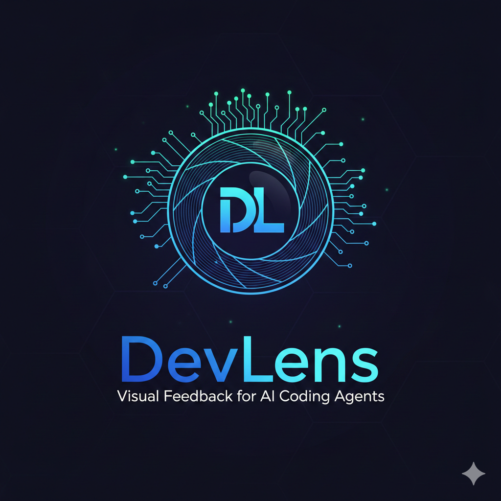

<div align="center">



# DevLens

<p>
<a href="https://www.npmjs.com/package/devlens"></a>
<a href="LICENSE"></a>
<a href="https://www.npmjs.com/package/devlens"></a>


</p>

MCP server that gives AI coding agents visual feedback on frontend apps. One command, no config — your AI agent can now see your app, click buttons, read console errors, and diff visual changes.

</div>

```
npx devlens http://localhost:3000
```

## The Problem

When using AI coding agents (Claude Code, Cursor, Windsurf) for frontend development, the agent is blind. It can edit code but can't see what the app looks like. This creates a painful manual loop:

1. Agent makes a code change
2. You look at the browser
3. You describe the visual issue in words, or screenshot and drag into chat
4. You copy console errors manually
5. Repeat dozens of times per session

DevLens eliminates this loop entirely.

## How It Works

```
Your app (localhost:3000)
        |
Headless Chrome (Puppeteer)
        |
DevLens MCP Server
        |
Claude Code / Cursor / Windsurf
```

DevLens launches a headless browser pointed at your dev server, collects console logs and network errors passively, and exposes tools that any MCP-compatible AI agent can call — screenshots, clicking, typing, DOM inspection, visual diffing — without you doing anything manually.

## Why DevLens over Playwright MCP / Browser MCP?

General-purpose browser automation MCPs expose low-level primitives — you get `evaluate JavaScript`, `take screenshot`, `click element` as separate, disconnected actions. DevLens is purpose-built for the AI frontend development loop, which changes the design in ways that matter:

| | DevLens | General browser MCPs |
|---|---|---|
| **Setup** | `npx devlens <url>` — zero config | Requires browser launch management, connection handling |
| **Console/network errors** | Collected passively in the background. Agent checks whenever it wants. | Agent must actively poll or set up listeners. Errors between tool calls are lost. |
| **Interaction feedback** | Every `click`, `type`, `navigate` automatically returns a screenshot | Agent must remember to take a screenshot after each action |
| **Visual regression** | Built-in `visual_diff` — baseline capture, pixel comparison, diff image, change percentage | Not available. Agent would need to screenshot, store, compare manually. |
| **Visual quality review** | `visual_audit` returns a structured checklist that prompts the agent to critically evaluate layout, contrast, content accuracy | No equivalent. Agents tend to superficially confirm "looks good" without guidance. |
| **Live debugging** | `toggle_headless` to pop open Chrome and watch the agent work in real time | Typically headless-only or requires restart |
| **Multi-route audit** | `multi_route_screenshot` captures multiple pages in one call | Agent must navigate and screenshot each route individually |

DevLens doesn't try to be a general browser automation framework. It does one thing — give your AI coding agent eyes on your frontend — and removes every manual step from that loop.

## Quick Start

### 1. Start your dev server

```bash
npm run dev
# App running at http://localhost:5173
```

### 2. Add DevLens to your MCP config

**Claude Code** (`.mcp.json` in project root):

```json
{
  "mcpServers": {
    "devlens": {
      "command": "npx",
      "args": ["devlens", "http://localhost:5173"]
    }
  }
}
```

**Cursor** (`.cursor/mcp.json`):

```json
{
  "mcpServers": {
    "devlens": {
      "command": "npx",
      "args": ["devlens", "http://localhost:5173"]
    }
  }
}
```

### 3. Start your agent

That's it. The agent now has access to all DevLens tools. Ask it to "take a screenshot of my app" or "check for console errors" and it just works.

## Tools

### Observation

| Tool | Description |
|------|-------------|
| `screenshot` | Capture the current page as PNG. Optional `route` to navigate first, `fullPage` for entire scrollable page. |
| `screenshot_element` | Screenshot a specific DOM element by CSS selector. |
| `console_logs` | Returns all console output (log, warn, error) since last call. Clears buffer after returning. |
| `network_errors` | Returns all failed network requests since last call. Clears buffer after returning. |
| `visual_audit` | Screenshot with a guided checklist prompting the agent to critically assess content accuracy, layout, contrast, and polish — not just confirm things render. |

### Interaction

| Tool | Description |
|------|-------------|
| `click` | Click an element by selector. Returns screenshot after click. |
| `type` | Type text into an input field. Optional `clear` to replace existing content. Returns screenshot. |
| `navigate` | Go to a URL or path. Returns screenshot of the new page. |
| `set_viewport` | Resize to a preset (`mobile` 375x812, `tablet` 768x1024, `desktop` 1280x720) or custom `width`/`height`. Returns screenshot. |
| `dom_inspect` | Get computed styles, classes, children, and bounding box for an element. |

### Diffing

| Tool | Description |
|------|-------------|
| `visual_diff` | Compare current page against a stored baseline. First call captures baseline, subsequent calls return a diff image with changed pixels highlighted and a percentage summary. |
| `multi_route_screenshot` | Screenshot multiple routes in one call. Returns labeled images for each route. |

### Debug

| Tool | Description |
|------|-------------|
| `toggle_headless` | Switch between headless and visible browser. When visible, a Chrome window appears so you can watch the agent interact with your app in real time. |

## CLI Options

```
devlens <url> [options]

Options:
  --no-headless        Show the browser window
  --viewport <preset>  Initial viewport: mobile | tablet | desktop (default: desktop)
  -h, --help           Show help
```

## Architecture

```
src/
├── index.ts              # CLI entry point, arg parsing
├── server.ts             # MCP server, tool registration
├── browser.ts            # Puppeteer lifecycle, passive log/error collection
├── tools/
│   ├── screenshot.ts     # screenshot, screenshot_element, multi_route_screenshot
│   ├── console.ts        # console_logs, network_errors
│   ├── interact.ts       # click, type, navigate, set_viewport
│   ├── inspect.ts        # dom_inspect
│   └── diff.ts           # visual_diff
└── utils/
    └── viewport-presets.ts
```

Key design decisions:

- **Lazy connection** — The MCP server starts immediately. Navigation to your app happens on the first tool call, so DevLens never crashes if your dev server isn't running yet.
- **Passive collection** — Console logs and network errors are captured in ring buffers from the moment the browser launches. The agent checks when it wants to, not when events happen.
- **Screenshots after every interaction** — `click`, `type`, `navigate`, and `set_viewport` all return a screenshot so the agent always sees the result of what it did.
- **Baseline storage** — Visual diff baselines are stored in memory per route. No filesystem setup needed.

## Development

```bash
git clone https://github.com/amoghmanral/DevLens.git
cd DevLens
npm install
npm run build
```

To test locally with Claude Code:

```bash
claude mcp add devlens -- node /path/to/DevLens/dist/index.js http://localhost:3000
```

## Tech Stack

- **TypeScript** — Type-safe tool handlers and MCP integration
- **Puppeteer** — Headless Chrome automation (bundles Chromium)
- **@modelcontextprotocol/sdk** — Official MCP server SDK
- **pixelmatch** + **pngjs** — Pixel-level image comparison for visual diffing

## License

MIT
